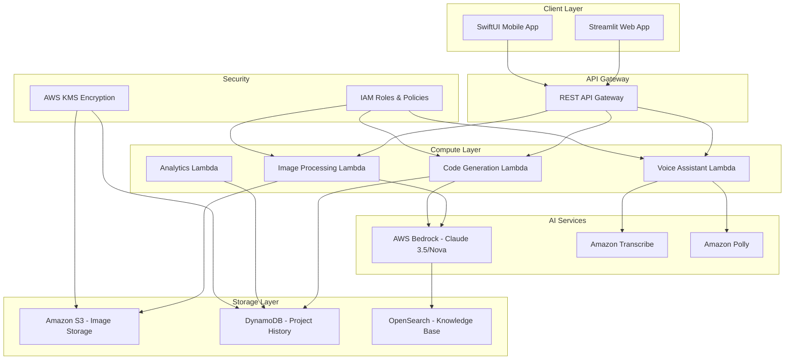

# Design Document: DevVisual

## Overview

DevVisual is a serverless, AWS-native multimodal AI productivity tool that transforms hand-drawn sketches into functional code. The system leverages AWS Bedrock's multimodal capabilities to process images and generate explanations, while maintaining a camera-first user experience optimized for engineering workflows.

The architecture follows an event-driven serverless pattern, ensuring scalability and cost-effectiveness for hackathon demonstration and potential production deployment.

## Architecture

### System Architecture



The architecture implements a serverless event-driven pattern where each component can scale independently based on demand, crucial for hackathon demonstration and real-world usage patterns.

## Data Flow

### Primary Processing Pipeline

1. **Image Upload Flow**
   - User captures/uploads image via Streamlit/SwiftUI interface
   - Image uploaded directly to S3 bucket with pre-signed URLs
   - S3 PUT event triggers Image Processing Lambda function
   - Lambda validates image quality and extracts metadata

2. **Multimodal Analysis Flow**
   - Image Processing Lambda calls AWS Bedrock with multimodal prompt
   - Bedrock (Claude 3.5/Nova) analyzes image for component identification
   - System determines sketch type (KiCad schematic vs UI wireframe)
   - Bedrock returns structured analysis with confidence scores

3. **Code Generation Flow**
   - Code Generation Lambda receives analysis results
   - RAG system queries OpenSearch for relevant technical datasheets
   - Bedrock generates code snippets with contextual explanations
   - Generated code stored in DynamoDB with project metadata

4. **Response Delivery Flow**
   - Results formatted and returned via API Gateway
   - Frontend displays code, explanations, and BOM in organized tabs
   - Analytics Lambda logs performance metrics asynchronously

### Voice-Guided Debugging Flow

1. User activates voice mode in frontend
2. Audio captured and sent to Amazon Transcribe
3. Voice Assistant Lambda processes transcribed text
4. Context retrieved from DynamoDB (current project state)
5. Bedrock generates debugging guidance
6. Amazon Polly converts response to speech
7. Audio response delivered to user

## Components and Interfaces

### Frontend Components

#### Streamlit Web Application
- **Camera Integration**: Direct camera access for sketch capture
- **Upload Interface**: Drag-and-drop with progress indicators
- **Results Dashboard**: Tabbed interface for code, explanations, BOM
- **Voice Controls**: Push-to-talk debugging assistance
- **Project History**: Access to previous conversions

#### SwiftUI Mobile Application
- **Native Camera**: Optimized for sketch photography with guides
- **Offline Caching**: Store recent projects for offline viewing
- **Voice Integration**: Hands-free operation during hardware assembly
- **Share Extensions**: Export generated code to development tools

### AI Engine Components

#### Prompt Engineering Strategies

**Electronics Component Identification:**
```
System: You are an expert electronics engineer analyzing hand-drawn schematics.

Context: Analyze this image for electronic components and connections.

Instructions:
1. Identify each component type (resistor, capacitor, IC, etc.)
2. Extract component values where visible
3. Map connections between components
4. Generate KiCad-compatible netlist
5. Provide confidence scores for each identification

Output Format: JSON with components array and connections matrix
```

**UI Element Recognition:**
```
System: You are a UI/UX expert analyzing wireframe sketches.

Context: Convert this hand-drawn wireframe to functional code.

Instructions:
1. Identify UI elements (buttons, text fields, layouts)
2. Determine spatial relationships and hierarchy
3. Infer user interaction patterns
4. Generate SwiftUI/Streamlit code maintaining design intent
5. Include accessibility considerations

Output Format: Structured code with component hierarchy
```

#### Knowledge Base Integration

**RAG Implementation with OpenSearch:**
- **Document Ingestion**: Technical datasheets, component specifications, code examples
- **Vector Embeddings**: AWS Bedrock embeddings for semantic search
- **Query Enhancement**: Context-aware retrieval based on identified components
- **Response Augmentation**: Enrich code generation with relevant technical details

### Backend Services

#### Image Processing Lambda
- **Runtime**: Python 3.11 with PIL/OpenCV
- **Memory**: 1GB for image processing operations
- **Timeout**: 5 minutes for complex analysis
- **Triggers**: S3 PUT events, API Gateway requests
- **Outputs**: Structured component analysis, quality metrics

#### Code Generation Lambda
- **Runtime**: Python 3.11 with code generation libraries
- **Memory**: 2GB for complex code synthesis
- **Timeout**: 10 minutes for comprehensive generation
- **Integration**: Bedrock API, OpenSearch queries
- **Outputs**: Formatted code files, documentation, BOM

#### Voice Assistant Lambda
- **Runtime**: Python 3.11 with audio processing
- **Memory**: 512MB for text processing
- **Timeout**: 30 seconds for real-time response
- **Integration**: Transcribe, Polly, Bedrock
- **Outputs**: Audio responses, debugging guidance

## Data Models

### DynamoDB Schema

#### Projects Table
```json
{
  "PK": "USER#user_id",
  "SK": "PROJECT#project_id",
  "project_name": "string",
  "created_at": "timestamp",
  "updated_at": "timestamp",
  "sketch_type": "kicad|ui_wireframe",
  "s3_image_key": "string",
  "processing_status": "pending|processing|completed|failed",
  "generated_code": {
    "language": "kicad|swiftui|streamlit",
    "code_content": "string",
    "file_name": "string"
  },
  "component_analysis": {
    "identified_components": [
      {
        "type": "string",
        "value": "string",
        "confidence": "number",
        "bounding_box": "object"
      }
    ],
    "connections": "array",
    "accuracy_score": "number"
  },
  "bill_of_materials": [
    {
      "component": "string",
      "quantity": "number",
      "part_number": "string",
      "supplier": "string",
      "estimated_cost": "number"
    }
  ],
  "ai_explanations": {
    "component_reasoning": "string",
    "design_decisions": "string",
    "alternatives": "array"
  }
}
```

#### Analytics Table
```json
{
  "PK": "ANALYTICS#date",
  "SK": "METRIC#metric_type",
  "processing_time": "number",
  "accuracy_score": "number",
  "user_feedback": "number",
  "component_count": "number",
  "sketch_complexity": "simple|medium|complex"
}
```

### OpenSearch Knowledge Base Schema

#### Component Datasheets Index
```json
{
  "component_id": "string",
  "component_type": "string",
  "manufacturer": "string",
  "part_number": "string",
  "specifications": "object",
  "datasheet_url": "string",
  "embedding_vector": "dense_vector",
  "usage_examples": "array",
  "kicad_footprint": "string"
}
```

## Interface Design

### Camera-First Experience

#### Primary Interface Flow
1. **Capture Screen**: Large camera viewfinder with overlay guides
   - Grid lines for alignment
   - Component detection hints
   - Lighting quality indicator

2. **Processing Screen**: Real-time progress with AI insights
   - Component identification progress
   - Confidence indicators
   - Processing stage updates

3. **Results Screen**: Clean, organized output display
   - Code viewer with syntax highlighting
   - Explanation panel with expandable sections
   - BOM table with supplier links
   - Export options (download, share, integrate)

#### Mobile-Optimized Features
- **Gesture Controls**: Pinch-to-zoom on results, swipe between tabs
- **Voice Activation**: "Hey DevVisual" wake word for hands-free operation
- **Offline Mode**: Cache recent projects for assembly reference
- **AR Preview**: Overlay component labels on camera view (future enhancement)

### Accessibility Considerations
- **Voice Navigation**: Complete voice control for hands-free operation
- **High Contrast Mode**: Enhanced visibility for outdoor/workshop use
- **Text Scaling**: Adjustable font sizes for detailed code review
- **Screen Reader Support**: Full compatibility with assistive technologies

## Security

### IAM Roles and Policies

#### Lambda Execution Roles

**Image Processing Lambda Role:**
```json
{
  "Version": "2012-10-17",
  "Statement": [
    {
      "Effect": "Allow",
      "Action": [
        "s3:GetObject",
        "s3:PutObject"
      ],
      "Resource": "arn:aws:s3:::devvisual-images/*"
    },
    {
      "Effect": "Allow",
      "Action": [
        "bedrock:InvokeModel"
      ],
      "Resource": "arn:aws:bedrock:*:*:foundation-model/anthropic.claude-3-5-sonnet*"
    },
    {
      "Effect": "Allow",
      "Action": [
        "dynamodb:PutItem",
        "dynamodb:UpdateItem"
      ],
      "Resource": "arn:aws:dynamodb:*:*:table/devvisual-projects"
    }
  ]
}
```

**Code Generation Lambda Role:**
```json
{
  "Version": "2012-10-17",
  "Statement": [
    {
      "Effect": "Allow",
      "Action": [
        "bedrock:InvokeModel"
      ],
      "Resource": "arn:aws:bedrock:*:*:foundation-model/*"
    },
    {
      "Effect": "Allow",
      "Action": [
        "es:ESHttpGet",
        "es:ESHttpPost"
      ],
      "Resource": "arn:aws:es:*:*:domain/devvisual-knowledge/*"
    },
    {
      "Effect": "Allow",
      "Action": [
        "dynamodb:GetItem",
        "dynamodb:PutItem",
        "dynamodb:UpdateItem"
      ],
      "Resource": "arn:aws:dynamodb:*:*:table/devvisual-projects"
    }
  ]
}
```

### Data Protection

#### Encryption Strategy
- **S3 Encryption**: Server-side encryption with AWS KMS
- **DynamoDB Encryption**: Encryption at rest with customer-managed keys
- **Transit Encryption**: TLS 1.3 for all API communications
- **Lambda Environment**: Encrypted environment variables for API keys

#### Data Retention Policy
- **Image Storage**: Automatic deletion after 24 hours unless explicitly saved
- **Project Data**: User-controlled retention with automatic cleanup options
- **Analytics Data**: Aggregated metrics only, no personal information
- **Audit Logs**: CloudTrail integration for security monitoring

### Privacy Compliance
- **Data Minimization**: Collect only necessary information for functionality
- **User Consent**: Explicit opt-in for analytics and model improvement
- **Right to Deletion**: Complete data removal on user request
- **Geographic Compliance**: Data residency controls for international users

## Error Handling

### Graceful Degradation Strategy

#### Image Quality Issues
- **Low Resolution**: Upscaling with quality warnings
- **Poor Lighting**: Enhancement suggestions with retry options
- **Unclear Sketches**: Confidence scoring with manual correction interface
- **Unsupported Formats**: Automatic conversion with format recommendations

#### AI Service Failures
- **Bedrock Throttling**: Exponential backoff with user notification
- **Model Unavailability**: Fallback to alternative models with capability notes
- **Context Length Limits**: Automatic image segmentation for complex sketches
- **Confidence Thresholds**: Manual review prompts for low-confidence results

#### System Resilience
- **Lambda Cold Starts**: Pre-warming strategies for critical functions
- **DynamoDB Throttling**: Adaptive retry logic with exponential backoff
- **S3 Availability**: Multi-region replication for critical images
- **Network Failures**: Offline mode with sync-when-available functionality

## Testing Strategy

### Dual Testing Approach

The testing strategy combines comprehensive unit testing for specific scenarios with property-based testing for universal correctness validation.

#### Unit Testing Focus
- **Image Processing Edge Cases**: Blurry images, extreme lighting, rotated sketches
- **Code Generation Examples**: Standard circuit patterns, common UI layouts
- **Integration Points**: API Gateway responses, Lambda function chaining
- **Error Conditions**: Invalid inputs, service failures, timeout scenarios

#### Property-Based Testing Focus
- **Universal Properties**: Component identification consistency, code compilation validity
- **Input Coverage**: Randomized sketch variations, diverse component combinations
- **Performance Properties**: Response time consistency, memory usage bounds
- **Security Properties**: Access control validation, data encryption verification

**Property Test Configuration:**
- **Framework**: Hypothesis for Python-based Lambda functions
- **Iterations**: Minimum 100 per property test for statistical confidence
- **Test Tagging**: Each test references specific design properties
- **CI Integration**: Automated execution on deployment pipeline

The combination ensures both concrete bug detection through unit tests and comprehensive correctness validation through property-based testing, essential for AI-driven code generation reliability.

## Correctness Properties

*A property is a characteristic or behavior that should hold true across all valid executions of a system—essentially, a formal statement about what the system should do. Properties serve as the bridge between human-readable specifications and machine-verifiable correctness guarantees.*

### Property 1: Input Validation Consistency
*For any* uploaded file, the system should accept valid image formats (JPEG, PNG, HEIC) and reject invalid formats with appropriate error messages, while validating image quality and size constraints consistently
**Validates: Requirements 1.1, 1.2, 1.3, 1.5**

### Property 2: Secure Storage Round Trip
*For any* valid uploaded image, storing to S3 and retrieving should preserve the image data while maintaining encryption and security settings
**Validates: Requirements 1.4, 7.1, 7.2**

### Property 3: Component Identification Accuracy
*For any* schematic or wireframe image containing standard symbols, the system should identify components with at least 85% accuracy and provide confidence scores for each identification
**Validates: Requirements 2.1, 2.5, 3.1**

### Property 4: Code Generation Compilation Validity
*For any* identified components or UI elements, the generated code (KiCad, SwiftUI, or Streamlit) should compile without errors in the target environment and include all necessary components
**Validates: Requirements 2.2, 2.3, 3.2, 3.3, 8.5**

### Property 5: Code Quality Standards Compliance
*For any* generated code, it should follow the appropriate style guidelines (KiCad specifications, Swift conventions, PEP 8) and include proper comments and documentation
**Validates: Requirements 8.1, 8.2, 8.3, 8.4**

### Property 6: BOM Generation Completeness
*For any* processed schematic with identified components, the system should generate a complete bill of materials with component specifications, quantities, and part numbers
**Validates: Requirements 2.4**

### Property 7: Layout Preservation Fidelity
*For any* UI wireframe, the generated code should preserve the spatial relationships and layout structure from the original sketch while including responsive design principles
**Validates: Requirements 3.4, 3.5**

### Property 8: Explanation Completeness
*For any* component identification or code generation operation, the system should provide explanations for choices, architectural decisions, and alternatives when applicable
**Validates: Requirements 4.1, 4.2, 4.4, 4.5**

### Property 9: Voice Response Timeliness
*For any* voice command or debugging query, the system should respond within 3 seconds with contextually relevant guidance that references the current project
**Validates: Requirements 5.1, 5.2, 5.3, 5.4, 5.5**

### Property 10: Processing Performance Bounds
*For any* uploaded image, processing should begin within 2 seconds, and completion time should be bounded by sketch complexity (30 seconds for simple, 2 minutes for complex)
**Validates: Requirements 6.1, 6.2, 6.3**

### Property 11: Scalability Under Load
*For any* concurrent user load, the system should maintain performance characteristics and scale automatically without degradation
**Validates: Requirements 6.4, 6.5**

### Property 12: Data Cleanup Consistency
*For any* processing session, temporary files should be automatically deleted within 24 hours, and user-requested deletions should be processed immediately
**Validates: Requirements 7.3, 7.4**

### Property 13: UI Presentation Standards
*For any* processing result, the system should display organized tabs (code, explanations, BOM) with syntax highlighting, download options, and progress indicators
**Validates: Requirements 9.2, 9.3, 9.4**

### Property 14: Cross-Platform Compatibility
*For any* device type (desktop or mobile), the system should provide full functionality and responsive interface behavior
**Validates: Requirements 9.5**

### Property 15: Analytics Collection Consistency
*For any* user interaction or processing operation, the system should collect accuracy metrics, performance data, and usage analytics while maintaining privacy compliance
**Validates: Requirements 10.1, 10.2, 10.3, 10.4, 10.5**